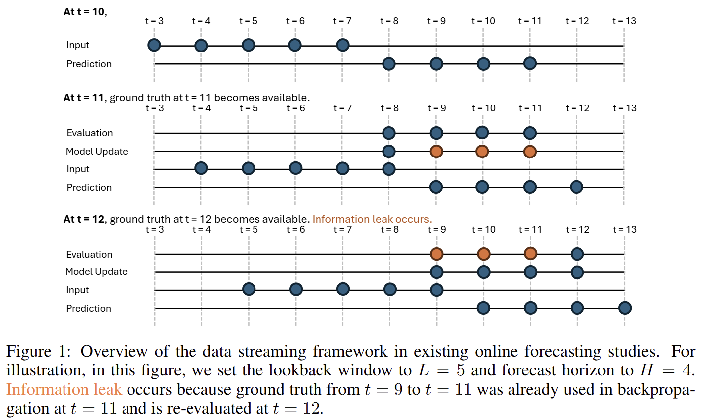
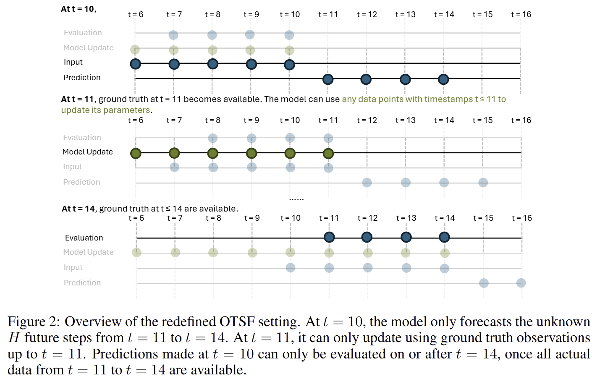
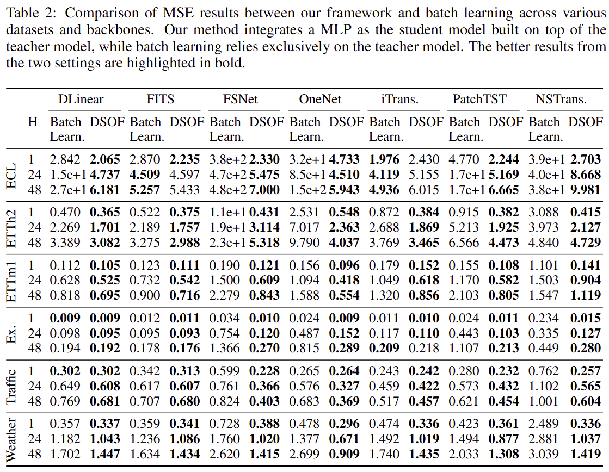
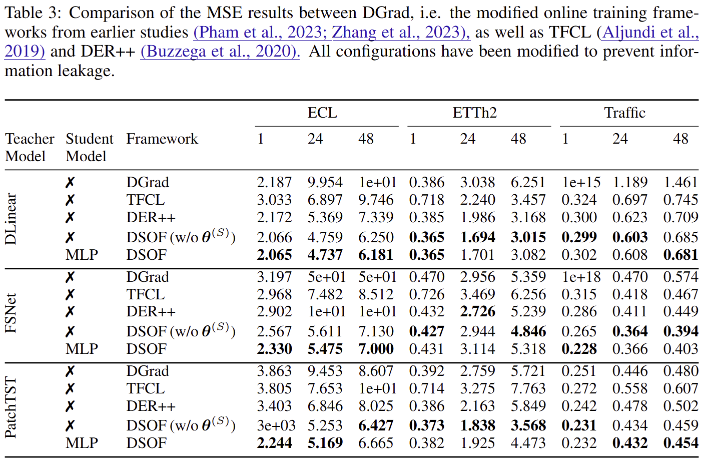

# DSOF (ICLR 2025)
This is the official repository for the ICLR 2025 Conference Paper - [Fast and Slow Streams for Online Time Series Forecasting without Information Leakage](https://openreview.net/forum?id=I0n3EyogMi). 

## Table of Contents
1. [Introduction](#introduction)
1. [Requirements / Installation](#requirements--installation)
1. [Basic Program Structure](#basic-program-structure)
1. [Running the Program](#running-the-program)
1. [Acknowledgements / References](#acknowledgements--references)
1. [Contact](#contact)
1. [Citation](#citation)

## Introduction
Current research in online time series forecasting (OTSF) faces two significant issues:



1. Information leakage. Models make predictions and are then evaluated on historical time steps that have already been used in backpropagation for parameter updates. 
1. Practicality. While forecasting in real-world applications typically emphasizes looking ahead and anticipating future uncertainties, prediction sequences in this setting include only one future step with the remaining being observed time points. 

This prompts a redefinition of the OTSF setting:



This new setting gives rise to challenges:
1. Leveraging incomplete pairs of ground truth and predictions for backpropagation
1. Avoid model overfitting to noise from recent data streams

To address these challenges, we propose a novel dual-stream framework for online forecasting (DSOF):
1. Slow stream: updates with complete data using experience replay
1. Fast stream: adapts to recent data through temporal difference learning.

Key Experimental results:




## Requirements / Installation
This code is written in **Python 3.8.0** on **Linux (AlmaLinux 9.5)**. To install the required packages, run the following commands:
```bash
# create a virtual environment
python -m venv venv

# activate the virtual environment
source venv/bin/activate

# install the required packages
pip install -r requirements.txt
```

## Basic Program Structure 
- `config`: YAML files that store the configurations for the program
    - `data`: stores the feature dimensions for datasets
    - `model`: configurations for the models (e.g., hidden layers, dropout rates, activation functions)
    - `optimizer`: three main categories of optimizers
        - `batch_learning`: for batch learning mode
        - `w_student`: for online learning mode with a student model
            - subfolders named `<teacherModel>_<studentModel>` (e.g., `DLinear_MLP`)
        - `wo_student`: for online learning mode without a student model
    - `trainer`: configurations for training schemes
        - `w_student`: with a student model
        - `wo_student`: without a student model (includes batch learning)

- `datasets`: stores datasets in CSV format
- `exps`: stores experiment results
    - Example: Using `DLinear` as the teacher model, `MLP` as the student model, and `w_student/residual/dsof` as the training scheme, running on `Electricity` and `ETTh2` datasets with prediction lengths `1`, `24`, and `48`, starting on March 1, 2025, at 9:30:45 AM, with two iterations. After running `python run_main.py`, the following files are generated:
        ```
        exps
        |--DLinear-MLP-w_student
            |--DLinear--MLP--w_student_residual_dsof
                |--Electricity_pl1
                    |--20250301-093045
                        |--itr0
                            |--checkpoints
                            |--results
                                |--mae.npy
                                |--metrics.npy
                                |--mse.npy
                                |--preds.npy
                                |--true.npy
                        |--itr1
                        hparams.yaml
                |--Electricity_pl24
                |--Electricity_pl48
                |--ETTh2_pl1
                |--ETTh2_pl24
                |--ETTh2_pl48
            ```
- `logs`: stores experiment logs if `use_nohup = True`, with a similar structure to `exps`
- `images`: stores images used in this README file
- `misc`: includes supporting files for `run_main.py` and file management utilities for `exps` and `logs`
- `src`: contains the source code
    - `src/data`: data processing
    - `src/model`: model definitions
    - `src/trainers`: training schemes
    - `src/utils`: utility functions
    - `src/main.py`: main program
- `run_main.py`: driver program to run `main.py` with different configurations, including a queuing mechanism to avoid GPU overload

## Running the Program 

1. Download datasets to the `datasets` directory: follow the instructions of [this repository](https://github.com/thuml/Autoformer). Then configure the dataset paths in `config/data/*.yaml` files.

1. Replace the variable `hex2dec_busmap` with a dictionary in the format `hostname: {bus-id: gpu-id}`. It is located in the method `def pid_gpu_cmd_mapping()` in `misc/runnerbase.py`. The mapping of `bus-id` to `gpu-id` can be found by running the command `nvidia-smi` in the terminal.

1. Configure options in `run_main.py`. These options override the default configurations in `config/` files.
    + `nohup`: Run experiments in the background. Set `use_nohup = False` to show logs in the terminal.

    + `gpus`: Allocate GPU resources. For example, `"Electricity": 3` uses GPU 3 for the Electricity dataset.
        ```python
        gpus = {
            "Electricity": 3,
            "ETTh2": 3,
            "ETTm1": 4,
            "Traffic": 4,
            "Exchange": 4,
            "Weather": 4,
            "others": 4,
        }
        ```

    + `pred_lens`: List of prediction lengths. For example, `pred_lens = [1, 24, 48]`.

    + `itr`: Number of iterations for each experiment. For example, `itr = 2` runs each experiment twice.

    + `datasets`: List of datasets to run experiments on. For example, `datasets = ["Electricity", ETTh2"]`. Available choices:
        - `Electricity`
        - `ETTh2`
        - `ETTm1`
        - `Exchange`
        - `Traffic`
        - `Weather`

    + `main_model`: Teacher model for training. `student_model`: Student model for training. Available choices:
        - `DLinear`
        - `FITS`
        - `FSNet`
        - `OneNet`
        - `iTransformer`
        - `PatchTST`
        - `NSTransformer`
        - `MLP` (only for student model)
        - `None` (only for student model, indicates no student model used)

    + `opt`: Optimizer used for training. Available choices:
        - `batch_learning`: For batch learning mode
        - `w_student`: For online learning mode with a student model
        - `wo_student`: For online learning mode without a student model

    + `trainer`: Training scheme used for training. Available choices match the filenames in `config/trainer/`. The DSOF method proposed in the paper corresponds to the option `w_student/residual/dsof`.

## Acknowledgements / References
This repository is based on code/datasets from the following repositories:
- [Autoformer](https://github.com/thuml/Autoformer)
- [DLinear](https://github.com/vivva/DLinear)
- [FITS](https://github.com/VEWOXIC/FITS)
- [FSNet](https://github.com/salesforce/fsnet)
- [iTransformer](https://github.com/thuml/iTransformer)
- [Non-stationary Transformer](https://github.com/thuml/Nonstationary_Transformers)
- [OneNet](https://github.com/yfzhang114/OneNet)
- [PatchTST](https://github.com/yfzhang114/OneNet)

## Contact
Authors:
1. [Ying-yee Ava Lau](mailto:yyalau@connect.ust.hk)
1. [Zhiwen Shao](mailto:zhiwen@ust.hk)
1. [Dit-Yan Yeung](mailto:dyyeung@cse.ust.hk)

Code issues: 
1. Submit an issue in the repository
2. Email [yyalau@connect.ust.hk](mailto:yyalau@connect.ust.hk)

## Citation
If you find this repo useful in your research, please consider citing our paper:
```
@inproceedings{
    lau2025dsof,
    title={Fast and Slow Streams for Online Time Series Forecasting Without Information Leakage},
    author={Ying-yee Ava Lau and Zhiwen Shao and Dit-Yan Yeung},
    booktitle={The Thirteenth International Conference on Learning Representations},
    year={2025},
    url={https://openreview.net/forum?id=I0n3EyogMi}
}
```
